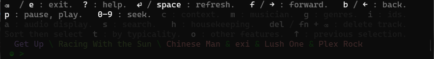
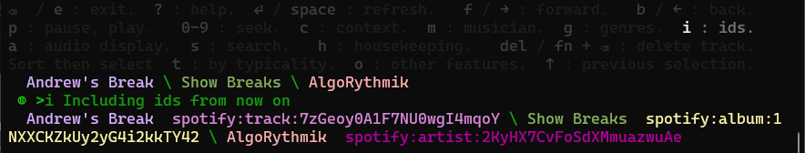
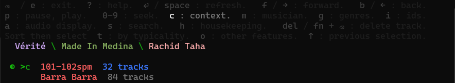
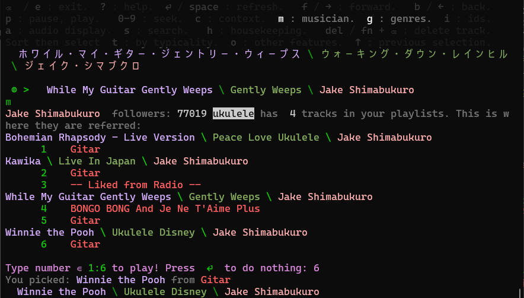
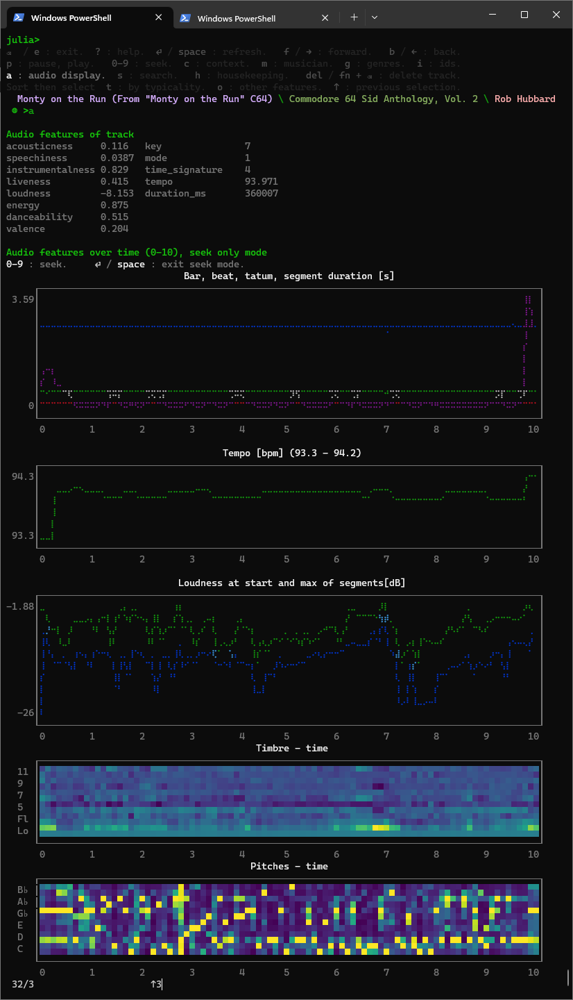
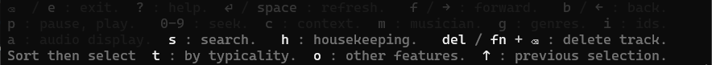

# ReplSpotifyPlayer
Built on the web API in [Spotify.jl](https://github.com/kwehmeyer/Spotify.jl).

This adds a `Spotify-mode` to Julia, extending what you can do with mouse clicks in the Spotify app. With such mode, we can read single keystrokes from the keyboard.


## Basic track controls
If you prefer the keyboard over a mouse, try these out! 



There are no background tasks checking if a track is finished. So press `space` to update the status line when a track is finished. `return` also re-prints the menu.

## Toggle ids



Toggling unique ids on with `i` will print those together with the name of all things. They are useful if you want to make your own scripts, but also uglify the status line and selection menus. Ids are also useful when two tracks have the same name.

## Contexts
A context is a container the track is playing from. Different context types are printed with different colors.



### Playlist context
In the figure above, we were playing from a playlist we own: "101-102spm", which has 32 tracks. The track also appears in one other playlist we own, "Barra Barra". This package focuses on managing playlist, and updates a local lookup table for those we own.

### Artist context

This is what you enter if you click on an artist in Spotify's app and pick a top track. When in the artist context, pressing `c` will show all the tracks by the artist which appear in your owned playlists.

### Album context

If you click on a track in an album, single or collection in Spotify's app, the context type is 'album'. In that case, pressing `c` would show some details about the album.


# Musician and genre


Pressing `m` will 
1) Show musician details, including all associated genres (in the above case, 'ukulele')
2) List all this musician's tracks in your playlistst (Jake Shimabukuro is exceptional: He has separate Spotify's identities for Japan and elsewhere.).
3) Let you jump to any of those tracks and contexts.

`g` for genres only shows musician details.

# Audio features


Pressing `a` is a quick way to get an overview of the current track. 

Above the plots, there is a list of [audio features](https://developer.spotify.com/documentation/web-api/reference/get-audio-features). These are
single numbers charaterizing the whole of the current track. These can be used directly for ranking of tracks in a context (see `o`), even for multi-dimensional rankings and playlist statistics.

Below the plots, a metronome is updated with every beat. Use numbers keys 1-9 to seek to a position within the track (0 is currently buggy). The bottom left fraction is 'current bar' / 'current beat'.

The graphic plots show the basis for audio features, distributed over time. In the example track, 'Time signature (beats per bar)' is constant at four beats per bar, and is therefore not plotted.⠀

The 'Timbre' plot is too abstract for most humans, but 'Pitches' basically shows the melody (and the amount of noise).

Expand the REPL window and zoom out the text size. This will increase the horizontal resolution of plots. 

# Advanced features


The remaining menu choices are made for pruning out the odd mistake in your playlists. We hope you like barplots and navigable lists.

Just beware when deleting tracks; we don't ask for confirmation there. You can always restore an old playlist version based on the returned snapshot it, but you would have to find out how yourself.

Good luck!

## Installation
```julia-repl
(@v1.8) pkg> registry add https://github.com/hustf/M8

(@v1.8) pkg> add ReplSpotifyPlayer

julia> dev Spotify.jl  # Check that you have the 'master' version. 

julia> push!(ENV, "SPOTIFY_NOINIT" => "true"); using ReplSpotifyPlayer

julia> # Press ':'

julia> 
e : exit.     f(→) : forward.     b(←) : back.     p: pause, play.     0-9:  seek.
del(fn + ⌫  ) : delete track from playlist. c : context. m : musician. g : genres.
i : toggle ids.       a : audio features.       h : housekeeping.      ? : syntax.
Sort then select  t : by typicality.  o : other features.  ↑ : previous selection.
  Harry's Record Machine \ Scratch Marchin' \ Kormac
 ◍ >
```
