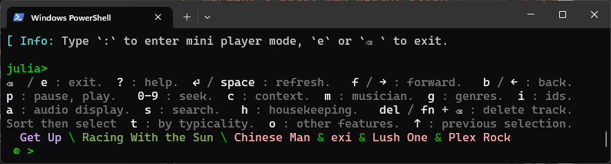

# ReplSpotifyPlayer
Built on the web API in [Spotify.jl](https://github.com/kwehmeyer/Spotify.jl).

This adds a 'Spotify-mode' to the Julia REPL. Use it in combination with Spotify's app. 
You can do some new things from this mode. Jump back to the `julia>` prompt 
to query and use the locally stored dataframe of tracks, audio features and playlist references.




--------------------


```
julia> # Press ':'

julia> 
e : exit.     f(→) : forward.     b(←) : back.     p: pause, play.     0-9:  seek.
del(fn + ⌫  ) : delete track from playlist. c : context. m : musician. g : genres.
i : toggle ids.       a : audio features.       h : housekeeping.      ? : syntax.
Sort then select  t : by typicality.  o : other features.  ↑ : previous selection.
  Harry's Record Machine \ Scratch Marchin' \ Kormac
 ◍ >
```
## What more you can do with it

Maybe you run Spotify on the phone and don't want to pick it up?  
You can also maintain your playlists in new ways:

- In which of your playlists does the current track appear?
- Identify bad fits in playlists.
- Is this artist already in your playlists, and where?
- Make barplots of danceability, beats per bar and other audio features in playlists. 
- Verify rhythm with the metronome.
- Suggest replacing tracks with original source tracks, make searching easier.
- Rebuild playlists based on audio or genre features (use `julia>` prompt for this!)
- Show and use genre information  (use `julia>` prompt)

## Installation
```julia-repl
(@v1.8) pkg> registry add https://github.com/hustf/M8

(@v1.8) pkg> add ReplSpotifyPlayer

julia> dev Spotify.jl  # Check that you have the 'master' version. 

julia> push!(ENV, "SPOTIFY_NOINIT" => "true"); using ReplSpotifyPlayer

julia> # Press ':'

julia> 
e : exit.     f(→) : forward.     b(←) : back.     p: pause, play.     0-9:  seek.
del(fn + ⌫  ) : delete track from playlist. c : context. m : musician. g : genres.
i : toggle ids.       a : audio features.       h : housekeeping.      ? : syntax.
Sort then select  t : by typicality.  o : other features.  ↑ : previous selection.
  Harry's Record Machine \ Scratch Marchin' \ Kormac
 ◍ >
```
